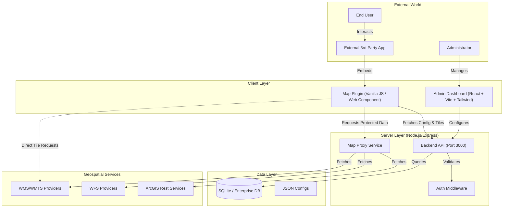

# System Architecture

## Overview
High-level architecture of the MapViewer platform.

## Component Details

### 1. Admin Dashboard (`/admin`)
- **Tech Stack**: React, Vite, Tailwind CSS, Lucide Icons, OpenLayers.
- **Purpose**: secure interface for managing maps, layers, basemaps, and API keys.
- **Features**:
  - Live Map Builder (WYSIWYG).
  - Layer styling and configuration.
  - API Key generation and domain restriction.
  - connect to external WMS/WFS services.

### 2. Map Plugin (`/plugin`)
- **Tech Stack**: Vanilla JavaScript (ES Modules), Vite, OpenLayers, generic Web Component (`<map-viewer>`).
- **Purpose**: Lightweight, embeddable map viewer for third-party applications.
- **Features**:
  - Drop-in `<map-viewer>` HTML tag.
  - Interactive feature selection and popups.
  - Layer toggling.
  - Measurement tools.

### 3. Backend Server (`/server`)
- **Tech Stack**: Node.js, Express, `sqlite3`/multidb support.
- **Purpose**: Central API and data persistence.
- **Key Services**:
  - **API Routes**: RESTful endpoints for configuration.
  - **Proxy Service**: Securely proxies requests to external geospatial services (CORS handling, auth hiding).
  - **Static Serving**: Hosts the compiled Admin and Plugin bundles.

### 4. Database
- **Primary**: SQLite (`database.sqlite`) for configuration storage (Maps, Layers, Keys).
- **Extensibility**: Supports migration to PostgreSQL, MySQL, MSSQL, or Oracle via connection strings.
